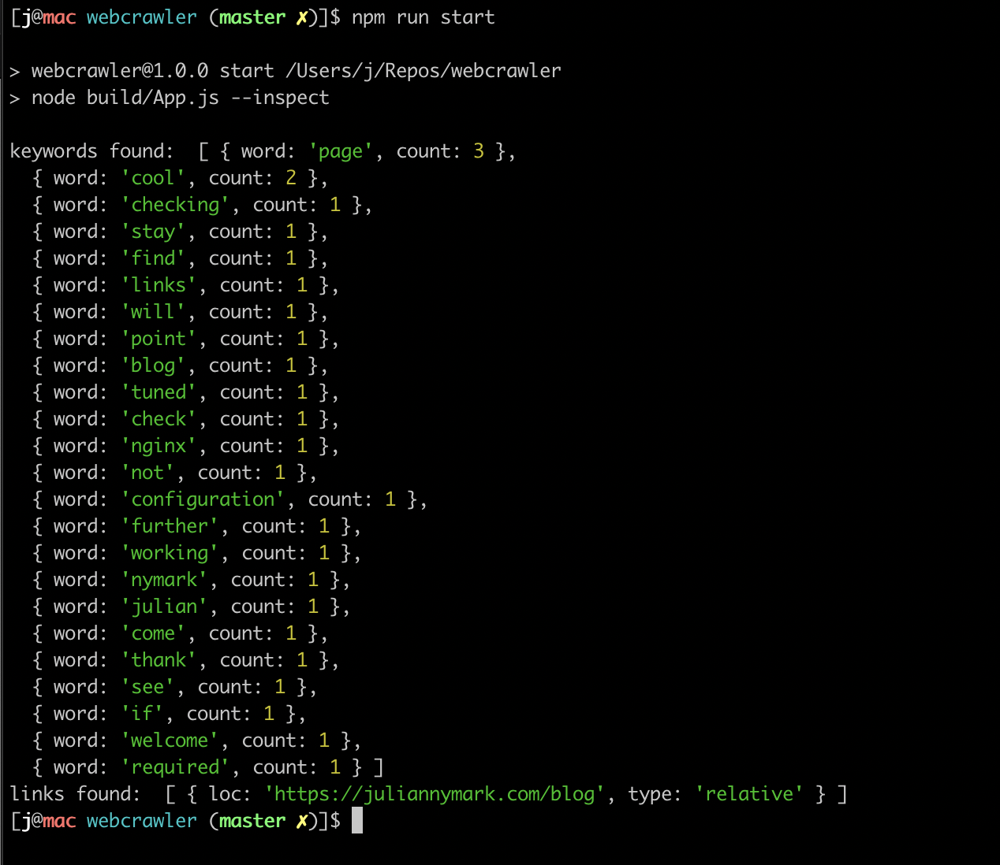

# webcrawler

MVP todo:
- [x] simple program to GET a html resource & find links (relative & absolute)
- [x] add the feature 'simple text analysis' (tally words used)
- [ ] spin up a DB (RDS), connect to it, insert links
- [ ] make webcrawler 'oneshot' per page (it kinda already is, but keep it simple by keeping it this way)
- [ ] perhaps another 'scheduler' service to fetch latest 'unprocessed' URL from DB, and fire 'oneshot' crawler on it (processing it).

